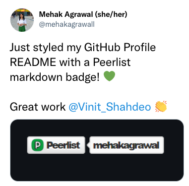

<div align="center">
  <a href="https://peerlist.io/vinitshahdeo">
    
  </a>
</div>

<h1 align="center">Peerlist <code>README</code> Badge</h1>

Peerlist is a community of working professionals focused on building a personal brand, sharing professional content, and finding peers to collaborate with. **A [Peerlist profile](https://peerlist.io/vinitshahdeo) can be used as a simple resume or a complete portfolio to showcase your work. You can style your `README.md` with an awesome Peerlist markdown badge.**

:arrow_down: Below are a few examples:

| Peerlist User  | Badge  |
|:---|:---|
| [Akash Bhadange](https://peerlist.io/designerdada) |  |
| [Pranjal Bareth](https://peerlist.io/pranjalbareth) |  |
| [Yogini Bende](https://peerlist.io/yogini)  |  |
| [Santosh Yadav](https://peerlist.io/santoshyadavdev) |  |
| [Vinit Shahdeo](https://peerlist.io/vinitshahdeo) |   |

> **Warning** The author might be biased above, but you get the point! 😉

## :handshake: How to use?

Replace `vinitshahdeo` in the markdown with your Peerlist username. **Get a [Peerlist profile here](https://peerlist.io/) if you don't have one already!**

```md

```


### :art: Style your badge:)

Additionally it supports the styles. **To use a different style**: Replace `flat-square` in the markdown with any of the styles below. :point_down:

```md

```

#### :traffic_light: Available styles

| Type  | Badge  |
|:---|:---|
| `flat` <br> <sub>This is the default style.<sub>  |  |
| `flat-square`  |   |
| `plastic`  |   |
| `social`  |   |
| `for-the-badge`  |   |

> **Note** It's always preferable to include a link to your Peerlist profile in the `README` badge.

```md
[](https://peerlist.io/vinitshahdeo)
````
[](https://peerlist.io/vinitshahdeo)

## :running_man: How to run locally?

### :arrow_right: Setup

1. Install all depedencies
```bash
npm i
```
2. Start the Express app
```bash
npm start
```

> The above command will start a local server that listens on port `3000` for connections.

### :arrows_counterclockwise: Run

Visit `http://localhost:3000/<peerlist-username>`

```bash
http://localhost:3000/vinitshahdeo
```

## :dart: What's next?

| Upcoming badge  | Inspired from  |
|---|---|
|  | [](https://twitter.com/Vinit_Shahdeo) |

*<sup>The above badge is dummy which can be retrieved using a query param: `beta=true` ⚠️</sup>* 

The ultimate goal is to create a **dynamic markdown badge that displays Peerlist followers count** similar to the Twitter badge shown above. This is currently blocked on a public API to fetch the followers for a Peerlist user.

## :rocket: Want to contribute?

Do you want to pitch in? If so, please consider developing a web app that generates the markdown badge dynamically based on the Peerlist username entered by the user. There will be an option to copy the markdown text. You can take inspiration from the [Badges Generator](https://badgesgenerator.com/).

### Social Summer Of Code (SSoC)

> This project is shortlisted for a three-months-long Open Source Program([Social Summer Of Code](https://ssoc.devfolio.co/)) Organized By Social in order to promote open source with new age technologies & help beginners to kickstart their open-source journey. Please get started by introducing yourself [here](https://github.com/vinitshahdeo/peerlist-readme-badge/discussions/6).

If you're a participant of [Social Summer Of Code](https://ssoc.devfolio.co/)(SSoC), please branch off from `feature/web-app` and raise a PR to `feature/web-app`. Currently this branch contains a `client` directory which contains a basic React boilerplate which can be developed further as a React app to generate Peerlist badges dynamically. In case, you have other frameworks in mind, please checkout a branch `feature/web-app-<your framework>` from `develop` and create your app within `client` directory. For building UI, take inspiration from [Badges Generator](https://badgesgenerator.com/) and [Shields.io](https://shields.io/).

#### Quick start

**1.** Fork [this](https://github.com/vinitshahdeo/peerlist-readme-badge/) repository.
Click on the <a href="https://github.com/vinitshahdeo/peerlist-readme-badge/"></a> symbol at the top right corner.

**2.** Clone the forked repository.

```bash
git clone https://github.com/<your-github-username>/peerlist-readme-badge
```

**3.** Navigate to the project directory.

```bash
cd peerlist-readme-badge
```

**4.** Checkout to the feature branch

```bash
git checkout feature/web-app
```

**5.** Create a new branch.

```bash
git checkout -b <your_branch_name>
```

**6.** Navigate to `client` directory

```bash
cd client
```

**7.** Make changes in source code.

**8.** Stage your changes and commit

```bash
#Add changes to Index
git add .

#Commit to the local repo
git commit -m "<your_commit_message>"
```

**9.** Push your local commits to the remote repo.

```bash
git push -u origin <your_branch_name>
```

**10.** Create a [PR](https://help.github.com/en/github/collaborating-with-issues-and-pull-requests/creating-a-pull-request) !

**11.** **Congratulations!** Sit and relax, you've made your contribution to [Peerlist README Badge](https://vinitshahdeo.github.io/peerlist-readme-badge/) project.

## :construction: Behind the scenes

Huge shoutout to [Shields.io](https://shields.io/) service for providing badges in the SVG format. :bow: Thank you [Pranjal](https://peerlist.io/pranjalbareth) for designing the poster.


## :hugs: Show some love!

**Did you like it?** :+1: If yes, please help me spread the Peerlist `README` badge. :green_heart: <br>



Show your support by [leaving a star](https://github.com/vinitshahdeo/peerlist-readme-badge/stargazers) or sharing your thoughts on [Twitter @vinit_shahdeo](https://twitter.com/Vinit_Shahdeo).

[](https://www.buymeacoffee.com/vinitshahdeo)
