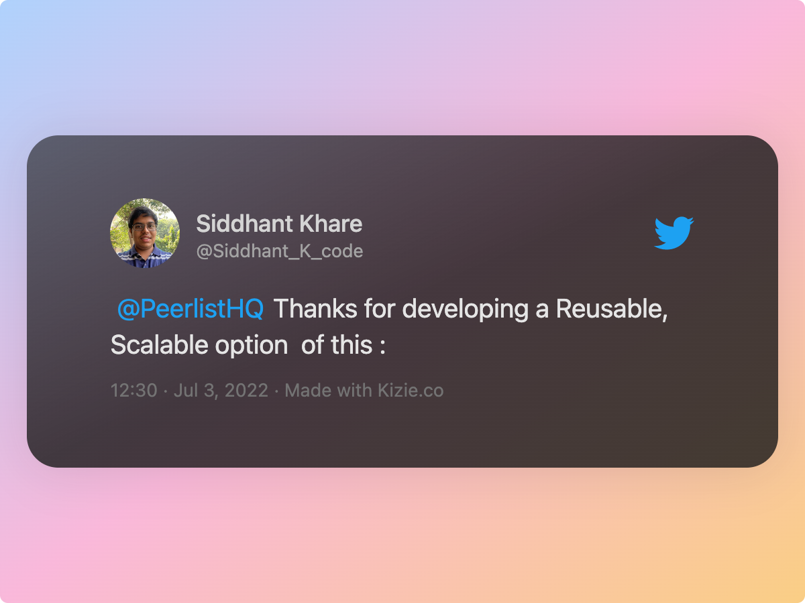

<div align="center">
  <a href="https://peerlist.io/vinitshahdeo">
    
  </a>
</div>

<h1 align="center">Peerlist <code>README</code> Badge</h1>


Peerlist is a community of working professionals focused on building a personal brand, sharing professional content, and finding peers to collaborate with. **A [Peerlist profile](https://peerlist.io/vinitshahdeo) can be used as a simple resume or a complete portfolio to showcase your work. You can style your `README.md` with an awesome Peerlist markdown badge.** This has now been integrated into the official Peerlist platform, **try it out here: [peerlist.io/tools/readme-badge](https://peerlist.io/tools/readme-badge)**

:arrow_down: Below are a few examples:

| Peerlist User  | Badge  |
|:---|:---|
| [Akash Bhadange](https://peerlist.io/designerdada) |  |
| [Pranjal Bareth](https://peerlist.io/pranjalbareth) |  |
| [Yogini Bende](https://peerlist.io/yogini)  |  |
| [Santosh Yadav](https://peerlist.io/santoshyadavdev) |  |
| [Vinit Shahdeo](https://peerlist.io/vinitshahdeo) |   |

> **Warning** The author might be biased above, but you get the point! 😉

## :handshake: How to use?

Replace `vinitshahdeo` in the markdown with your Peerlist username. **Get a [Peerlist profile here](https://peerlist.io/) if you don't have one already!**

```md

```


### :art: Style your badge:)

Additionally it supports the styles. **To use a different style**: Replace `flat-square` in the markdown with any of the styles below. :point_down:

```md

```

#### :traffic_light: Available styles

| Type  | Badge  |
|:---|:---|
| `flat` <br> <sub>This is the default style.<sub>  |  |
| `flat-square`  |   |
| `plastic`  |   |
| `social`  |   |
| `for-the-badge`  |   |

> **Note** It's always preferable to include a link to your Peerlist profile in the `README` badge.

```md
[](https://peerlist.io/vinitshahdeo)
````
[](https://peerlist.io/vinitshahdeo)

## API Documentation

[](https://www.postman.com/restless-rocket-22186/workspace/peerlist-readme-badges/collection/6178851-67cf0bab-e978-4a37-b3ad-a5b3b42bf69e)

`GET baseUrl/:username` - please refer to the [Peerlist README Badges public Postman collection](https://www.postman.com/restless-rocket-22186/workspace/peerlist-readme-badges/collection/6178851-67cf0bab-e978-4a37-b3ad-a5b3b42bf69e) for the API documentation. Feel free to fork and use! You can directly run the collection in Postman by using the below `Run in Postman` button :point_down:

[](https://god.gw.postman.com/run-collection/6178851-67cf0bab-e978-4a37-b3ad-a5b3b42bf69e?action=collection%2Ffork&collection-url=entityId%3D6178851-67cf0bab-e978-4a37-b3ad-a5b3b42bf69e%26entityType%3Dcollection%26workspaceId%3D2f408deb-7005-42ba-a5c8-f68362aabfb5#?env%5BPeerlist%20Badges%5D=W3sia2V5IjoiYmFzZVVybCIsInZhbHVlIjoiaHR0cHM6Ly9wZWVybGlzdC1yZWFkbWUtYmFkZ2UuaGVyb2t1YXBwLmNvbSIsImVuYWJsZWQiOnRydWUsInR5cGUiOiJkZWZhdWx0In1d)

## :running_man: How to run locally?

### :arrow_right: Setup

1. Install all dependencies
```bash
npm i
```
2. Start the Express app
```bash
npm start
```

> The above command will start a local server that listens on port `3000` for connections.

### :arrows_counterclockwise: Run

Visit `http://localhost:3000/<peerlist-username>`

```bash
http://localhost:3000/vinitshahdeo
```

> **Note** Please refer to the [Postman collection](https://www.postman.com/restless-rocket-22186/workspace/peerlist-readme-badges/collection/6178851-67cf0bab-e978-4a37-b3ad-a5b3b42bf69e) for the API documentation.

## :dart: What's next?

| Upcoming badge  | Inspired from  |
|---|---|
|  | [](https://twitter.com/Vinit_Shahdeo) |

*<sup>The above badge is dummy which can be retrieved using a query param: `beta=true` ⚠️</sup>* 

The ultimate goal is to create a **dynamic markdown badge that displays Peerlist followers count** similar to the Twitter badge shown above. This is currently blocked on a public API to fetch the followers for a Peerlist user.

## :link: Online Badge Generator

[](https://app.netlify.com/sites/peerlist-readme-badge/deploys)

Try it out here: [peerlist-readme-badge.netlify.app](https://peerlist-readme-badge.netlify.app)

**Build locally** :point_down:

```sh
git checkout feature/web-app
cd client/peerlist-readme-badge
npm install
npm run start
```

## :rocket: Want to contribute?

[](https://github.com/vinitshahdeo/peerlist-readme-badge/issues) [](https://github.com/vinitshahdeo/peerlist-readme-badge/pulls)

Do you want to pitch in? If so, please consider developing a web app that generates the markdown badge dynamically based on the Peerlist username entered by the user. There will be an option to copy the markdown text. You can take inspiration from the [Badges Generator](https://badgesgenerator.com/).

> Check out open issues [here](https://github.com/vinitshahdeo/peerlist-readme-badge/issues). These are beginner-friendly issues for the participants of [Hacktoberfest'22](https://hacktoberfest.com/).

### Hacktoberfest 2022


As [Hacktoberfest'22](https://hacktoberfest.com/) is here, I have opened a few [beginner-friendly issues](https://github.com/vinitshahdeo/peerlist-readme-badge/issues) for newbies to get them started with open-source. Feel free to **open an issue**, **raise a pull request** or spread a word about the **[first-timers issues](https://github.com/vinitshahdeo/peerlist-readme-badge/issues)** opened here.

[](https://twitter.com/intent/tweet?url=https%3A%2F%2Fgithub.com%2Fvinitshahdeo%2Fpeerlist-readme-badge&via=vinit_shahdeo&text=Here%27re%20a%20few%20beginner-friendly%20issues&hashtags=Hacktoberfest%2C%20opensource%2C%20hacktoberfest2022%2C%20yourfirstPR)

### Social Summer Of Code (SSoC)

This project is shortlisted for a three-months-long Open Source Program([Social Summer Of Code](https://ssoc.devfolio.co/)) Organized By Social in order to promote open source with new age technologies & help beginners to kickstart their open-source journey. Please get started by introducing yourself [here](https://github.com/vinitshahdeo/peerlist-readme-badge/discussions/6).

> **Please refer to [SSoC.md](./SSoC.md) to get started.**

## Gratitude :heart:

A heartfelt thanks to the Peerlist team for adding this as a tool in their official platform: [peerlist.io/tools/readme-badge](https://peerlist.io/tools/readme-badge)


## :construction: Behind the scenes

Huge shoutout to [Shields.io](https://shields.io/) service for providing badges in the SVG format. :bow: Thank you [Pranjal](https://peerlist.io/pranjalbareth) for designing the poster.


## :hugs: Sharing is caring!

**Did you like it?** :+1: If yes, please help me spread the Peerlist `README` badge. :green_heart: <br>

[](https://twitter.com/intent/tweet?url=https%3A%2F%2Fgithub.com%2Fvinitshahdeo%2Fpeerlist-readme-badge&via=vinit_shahdeo&text=Here%27re%20a%20few%20beginner-friendly%20issues&hashtags=Hacktoberfest%2C%20opensource%2C%20hacktoberfest2022%2C%20yourfirstPR)

## :blue_heart: Wall of Love 

<a href="https://twitter.com/Vinit_Shahdeo/status/1543485188734234624"></a> <a href="https://twitter.com/Vinit_Shahdeo/status/1543485188734234624"></a> <br><a href="https://twitter.com/Vinit_Shahdeo/status/1543485188734234624"></a> <a href="https://twitter.com/Vinit_Shahdeo/status/1543485188734234624"></a> 

Show your support by [leaving a star](https://github.com/vinitshahdeo/peerlist-readme-badge/stargazers) or sharing your thoughts on [Twitter @vinit_shahdeo](https://twitter.com/Vinit_Shahdeo).

<a href="https://www.buymeacoffee.com/vinitshahdeo" target="_blank"></a>
